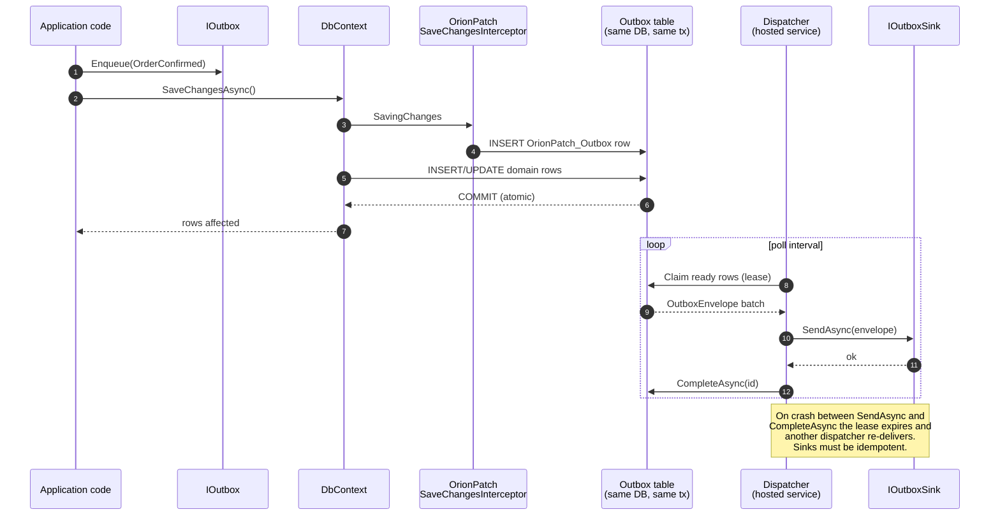

<p align="center">
  
</p>

<h1 align="center">OrionPatch</h1>

<p align="center">
  Transactional outbox primitive for .NET. Enqueue inside SaveChanges, dispatch at-least-once through a pluggable sink.
</p>

<p align="center">
  <a href="https://www.nuget.org/packages/OrionPatch"></a>
  <a href="https://www.nuget.org/packages/OrionPatch"></a>
  <a href="LICENSE.txt"></a>
  
</p>

---

## What it does

OrionPatch is a transactional outbox primitive for .NET. You enqueue a message inside an EF Core `SaveChanges` call; it commits in the same transaction as your domain data; a background dispatcher hands it to a pluggable `IOutboxSink` at-least-once.

The current release is 0.3.0. The "What ships" and "does NOT do" sections below describe the original v0.1.0 surface as historical record; capabilities added since then (inbox, concrete broker sinks, and the v0.3.0 dead-letter store and archival APIs) are documented in their own sections and in the [CHANGELOG](CHANGELOG.md).

The package is deliberately small. It does NOT ship a broker — RabbitMQ, Azure Service Bus, Kafka, NATS sinks live in separate opt-in sub-packages on the v0.2+ roadmap. v0.1.0 ships one concrete sink: `ChannelOutboxSink` (in-process `System.Threading.Channels`, zero external dependency, useful for monoliths and tests).

It is also deliberately scoped. No inbox in v0.1.0 - inbox idempotency, dedup tables, broker-side consumer wrappers are v0.2 work. v0.1.0 owns one thing well: getting a message from "I just did a domain mutation" to "the sink received it, exactly once per row, even if my process crashes between commit and send."

## How it works

A domain event is enqueued by application code, persisted by the EF Core interceptor inside the same transaction as your data, then handed to the sink asynchronously by a hosted dispatcher.



The diagram shows the at-least-once contract clearly: the outbox row and the domain rows commit together, but the sink call happens outside the transaction.

## Why OrionPatch?

| Feature                          | OrionPatch | DIY interceptor | MassTransit | Wolverine |
|----------------------------------|:----------:|:---------------:|:-----------:|:---------:|
| Transactional enqueue            | Yes        | Yes             | Yes         | Yes       |
| At-least-once dispatch           | Yes        | Maybe           | Yes         | Yes       |
| EF Core SaveChangesInterceptor   | Yes        | Yes             | Optional    | -         |
| Multi-provider claim (SQL Server/Postgres/MySQL/SQLite) | Yes (v0.2 for native SKIP LOCKED) | Maybe | Optional | Yes |
| Pluggable sink (no broker bundled) | Yes      | -               | Bundled     | Bundled   |
| Built-in retry + dead-letter     | Yes        | Maybe           | Yes         | Yes       |
| Dead-letter store (route exhausted rows out of the hot outbox) | Yes (v0.3) | Maybe | Yes | Yes |
| Outbox archival / retention (reap processed rows) | Yes (v0.3) | Maybe | Optional | Optional |
| OpenTelemetry                    | Yes        | Maybe           | Yes         | Yes       |
| In-process test sink             | Yes        | -               | Yes         | Yes       |
| Saga / process manager           | No (out of scope) | -        | Yes         | Yes       |
| Standalone primitive (no framework) | Yes     | Yes             | No          | No        |

OrionPatch is a primitive, not a framework. If you want sagas, request/response, or a built-in mediator, reach for MassTransit or Wolverine. If you want transactional outbox without adopting a messaging framework, OrionPatch is the package.

## 30-second quick start

```csharp
using Microsoft.EntityFrameworkCore;
using Microsoft.Extensions.DependencyInjection;
using Moongazing.OrionPatch.Abstractions;
using Moongazing.OrionPatch.DependencyInjection;
using Moongazing.OrionPatch.EntityFrameworkCore;
using Moongazing.OrionPatch.EntityFrameworkCore.DependencyInjection;

services.AddDbContext<AppDbContext>((sp, options) =>
{
    options.UseNpgsql(connectionString);
    options.UseOrionPatch(sp);
});

services.AddOrionPatch()
    .UseEntityFrameworkCore<AppDbContext>()
    .UseSink<MyKafkaSink>();   // or .UseChannelSink() for in-process
```

Apply the entity configuration in `OnModelCreating`:

```csharp
protected override void OnModelCreating(ModelBuilder modelBuilder) =>
    modelBuilder.ApplyOrionPatchConfiguration();
```

Enqueue from your service code:

```csharp
public class OrderService
{
    private readonly AppDbContext _db;
    private readonly IOutbox _outbox;

    public async Task ConfirmOrderAsync(Guid orderId, CancellationToken ct)
    {
        var order = await _db.Orders.FindAsync([orderId], ct);
        order.Confirm();

        _outbox.Enqueue(new OrderConfirmed(order.Id, order.TotalCents));

        await _db.SaveChangesAsync(ct);   // outbox row + order update commit together
    }
}
```

Implement a sink:

```csharp
public sealed class MyKafkaSink : IOutboxSink
{
    public async Task SendAsync(OutboxEnvelope envelope, CancellationToken ct)
    {
        // External publish — keep this the last statement of the implementation so
        // a failure after publish does not silently lose acknowledgement.
        await _producer.ProduceAsync(envelope.MessageType, envelope.Payload, ct);
    }
}
```

That's it. The dispatcher runs as a hosted service; messages flow from your transaction into the sink.

## What ships in v0.1.0

| Package | Description |
|---------|-------------|
| `OrionPatch` | Core: `IOutbox`, `IOutboxSink`, `IOutboxStorage`, dispatcher hosted service, telemetry, options. Includes `ChannelOutboxSink`. |
| `OrionPatch.EntityFrameworkCore` | EF Core storage backend: `OrionPatch_Outbox` table, provider-aware claim (`SKIP LOCKED` for SqlServer/Postgres/MySQL deferred to v0.2; SQLite + unknown providers use a portable compare-and-swap fallback today), `SaveChangesInterceptor` for transactional enqueue. |
| `OrionPatch.Testing` | Test helpers: in-memory storage, deterministic dispatcher, capturing sink, test clock, fluent assertions. Zero EF Core dependency. |

## What v0.1.0 does NOT do

- No inbox / dedup table (v0.2).
- No concrete broker sinks (RabbitMQ / Azure Service Bus / Kafka / NATS) — those are opt-in sub-packages on the v0.2+ roadmap.
- No saga / process manager (that is OrionFlow territory).
- No distributed transactions across heterogeneous sinks.
- No push-based dispatch (PostgreSQL `LISTEN/NOTIFY`, SQL Server Service Broker) — v0.3+ work.

## At-least-once contract

OrionPatch guarantees at-least-once delivery. Duplicates occur in two known scenarios:

1. The sink succeeds but the subsequent `CompleteAsync` write fails or the process crashes before it runs. The row stays Claimed, the lease expires, another dispatcher re-delivers.
2. The sink call exceeds `OrionPatchOptions.LeaseDuration` (default 2 minutes). Another dispatcher may claim and re-deliver the row mid-flight.

Consumer sinks MUST be idempotent. Typical patterns: deduplicate at the destination on `OutboxEnvelope.Id`, or use upserts. Keep the external publish the last statement of the sink implementation so a failure after publish does not silently lose acknowledgement.

## Dead-letter store and archival (v0.3.0)

v0.3.0 adds two outbox maintenance capabilities. Both are SPIs on the storage backend, not separate services: a storage type opts in by implementing the interface, and the dispatcher uses it when present.

### Dead-letter store (`IDeadLetterStore`)

When a row exhausts `OrionPatchOptions.MaxAttempts`, the dispatcher prefers to route it OUT of the hot outbox into a dedicated dead-letter store instead of flipping it to `DeadLettered` in place. Routing removes the source row from the active outbox (so it can never be reclaimed or retried) and appends a `DeadLetteredMessage` snapshot carrying the final failure context: payload, headers, correlation id, enqueue time, total attempt count, final error, and the dead-letter instant.

Routing is idempotent on the row id. A redelivered or crash-replayed terminal-path call for an already-routed row is a no-op, so a message lands in the store exactly once and produces no duplicate metrics or alerts. Storage that does not implement `IDeadLetterStore` keeps the prior in-place status flip, so this is backward compatible.

This is distinct from the v0.2.18 `IDeadLetterSink` observer. The sink is a fire-and-forget triage notification (Slack, PagerDuty); the store is the durable destination the message is moved into.

```csharp
// InMemoryOutboxStorage (and any storage that implements IDeadLetterStore) is detected by the
// dispatcher automatically. To inspect or replay abandoned messages, query the store directly:
if (storage is IDeadLetterStore deadLetterStore)
{
    IReadOnlyList<DeadLetteredMessage> abandoned =
        await deadLetterStore.GetDeadLetteredAsync(ct);

    foreach (var message in abandoned)
    {
        // message.Id, message.MessageType, message.Payload, message.FinalError,
        // message.AttemptCount, message.DeadLetteredAtUtc ...
    }
}
```

### Archival (`IOutboxArchivalStore`)

Successfully dispatched (`Processed`) rows accumulate in the hot outbox; an ever-growing table degrades claim-query planning and storage cost. `ArchiveProcessedAsync` reaps `Processed` rows whose `ProcessedAtUtc` is at or before `nowUtc - retention` out of the active outbox and returns the count moved. Pending, Claimed, and DeadLettered rows are never touched, and a processed row still inside the retention window is never touched. The reap is idempotent and incremental, so it is safe to call on a schedule.

`OrionPatchOptions.ArchiveRetention` (default 7 days, validated non-negative) expresses the retention horizon. `ArchiveProcessedAsync` is operator-invoked maintenance: OrionPatch does not start a background reaper, so call it from your own scheduled job (a hosted `BackgroundService`, Quartz.NET, Hangfire, or a cron-triggered endpoint).

```csharp
// Run from a scheduled maintenance job, e.g. nightly.
if (storage is IOutboxArchivalStore archivalStore)
{
    int reaped = await archivalStore.ArchiveProcessedAsync(
        options.Value.ArchiveRetention, DateTime.UtcNow, ct);
}
```

The bundled `InMemoryOutboxStorage` supports an archive mode (default; reaped rows are observable via `GetArchivedAsync`) and a purge mode (`new InMemoryOutboxStorage(purgeOnArchive: true)`; reaped rows are discarded).

## Telemetry

- `ActivitySource` and `Meter` named `Moongazing.OrionPatch`.
- Spans: `OrionPatch.Dispatch` per envelope, tagged with `orionpatch.message.type` and `orionpatch.attempt`.
- Counters: `orionpatch.outbox.enqueued`, `.dispatched`, `.failed`, `.deadlettered`, `.attempts`.
- Histogram: `orionpatch.outbox.dispatch.duration` (milliseconds).

Wire them up with the standard OpenTelemetry .NET helpers.

## Benchmarks

See [benchmarks.md](benchmarks.md) for the scenarios we plan to measure and the current status of the BenchmarkDotNet harness. A formal `bench/Moongazing.OrionPatch.Bench` project is on the v0.2 roadmap; the dispatcher has only been profiled informally during development so far.

## Roadmap

The current release is 0.3.0, which shipped the outbox dead-letter store (`IDeadLetterStore`) and outbox archival (`IOutboxArchivalStore`) described above. See the [CHANGELOG](CHANGELOG.md) for the full per-version history.

12-month forward plan in [ROADMAP.md](ROADMAP.md). The next milestones:

- Push-based dispatch (LISTEN/NOTIFY, Service Broker).
- Operator dashboard, schema-evolution helpers.
- v1.0.0: API freeze, LTS window.

If something on the list matters to you, open an issue with the `roadmap` label.

## More from the Orion family

OrionPatch is one of several standalone .NET libraries:

- [OrionGuard](https://github.com/tunahanaliozturk/OrionGuard) — input validation, guard clauses, DDD primitives.
- [OrionAudit](https://github.com/tunahanaliozturk/OrionAudit) — EF Core audit trail with JSON Patch diffs and time-travel reconstruction.
- [OrionKey](https://github.com/tunahanaliozturk/OrionKey) — source-generated strongly-typed IDs.
- [OrionLock](https://github.com/tunahanaliozturk/OrionLock) — distributed lock primitive with auto-renewing leases.

Each ships separately; none depends on another at runtime.

### See it in a real app

[Moongazing.OrionShowcase](https://github.com/tunahanaliozturk/OrionShowcase) is a production-shaped banking sample integrating all six Orion packages end-to-end. OrionPatch outbox interceptor captures Account/Customer domain events into the same transaction as SaveChanges. DomainEventOutboxAdapter walks AggregateRoot.DomainEvents and enqueues via reflection on IOutbox.Enqueue<T>. Concrete usage:

- [src/Moongazing.OrionShowcase.Infrastructure/Outbox/DomainEventOutboxAdapter.cs](https://github.com/tunahanaliozturk/OrionShowcase/blob/main/src/Moongazing.OrionShowcase.Infrastructure/Outbox/DomainEventOutboxAdapter.cs)
- [src/Moongazing.OrionShowcase.Infrastructure/DependencyInjection/InfrastructureServiceCollectionExtensions.cs](https://github.com/tunahanaliozturk/OrionShowcase/blob/main/src/Moongazing.OrionShowcase.Infrastructure/DependencyInjection/InfrastructureServiceCollectionExtensions.cs)

## Contributing

Issues and pull requests welcome. Please read [CONTRIBUTING.md](CONTRIBUTING.md) and the [Code of Conduct](CODE_OF_CONDUCT.md) before opening one.

## License

MIT. See [LICENSE.txt](LICENSE.txt).
